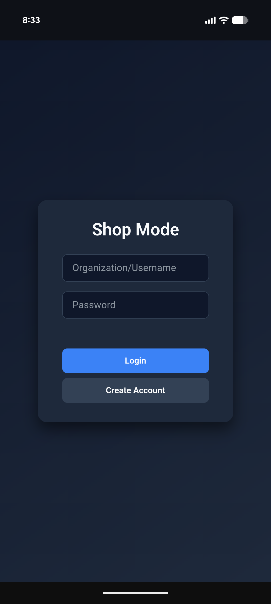
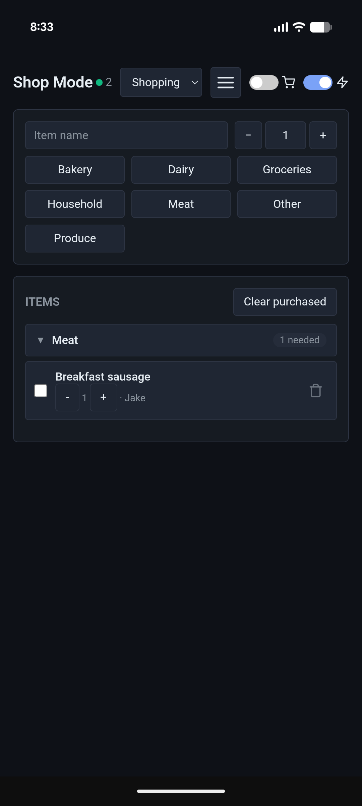
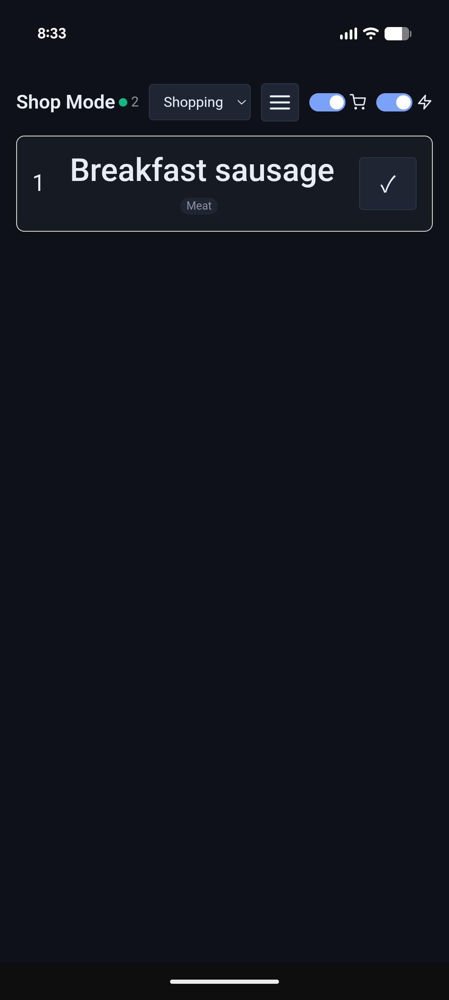

# 🛒 Shop Mode App

A modern, real-time collaborative shopping list application built with Go and vanilla JavaScript. Perfect for families, roommates, or teams who want to share and sync shopping lists across multiple devices.

[](https://hub.docker.com/r/rochteja/shopmode)
[](https://hub.docker.com/r/rochteja/shopmode)
[](https://hub.docker.com/r/rochteja/shopmode)

[](https://golang.org/)
[](LICENSE)

## ✨ Features

- 🔐 **Multi-tenant Authentication** - Secure user accounts with role-based access (Admin/User)
- 📋 **Multiple Lists** - Create and manage separate shopping lists for different purposes
- 🏷️ **Custom Categories** - Organize items by category (Groceries, Produce, Dairy, etc.)
- ⚡ **Real-time Sync** - WebSocket-based instant updates across all connected devices
- 📱 **Shopping Mode** - Large, touch-friendly interface optimized for in-store use
- 👁️ **Screen Wake Lock** - Keep your device screen on while shopping
- 🌙 **Dark Theme** - Beautiful, modern UI that's easy on the eyes
- 📦 **Progressive Web App** - Install on mobile devices for native app-like experience
- 🔢 **Quantity Tracking** - Track how many of each item you need
- 👥 **User Management** - Admins can create and manage team members
- 🔄 **Auto-reconnect** - WebSocket automatically reconnects if connection drops
- 🗂️ **Category Organization** - Collapsible category sections with item counts

## 📸 Screenshots

<table>
  <tr>
    <td></td>
    <td></td>
    <td></td>
  </tr>
  <tr>
    <td align="center"><b>Login Screen</b></td>
    <td align="center"><b>Main View</b></td>
    <td align="center"><b>Shopping Mode View</b></td>
  </tr>
</table>

## 🚀 Quick Start

### Prerequisites

- Docker and Docker Compose (recommended)
- OR Go 1.22+ for local development

### Production Deployment

1. **Create a directory for your app:**
```bash
mkdir shop-mode && cd shop-mode
```

2. **Create an `.env` file with secure secrets:**
```bash
cat > .env << EOF
SESSION_KEY=$(openssl rand -hex 32)
ADMIN_PASSWORD=$(openssl rand -base64 16)
APP_TITLE=Shop Mode
ORGANIZATION_NAME=MyFamily
EOF
```

3. **Create `docker-compose.yml`:**
```yaml
version: '3.8'

services:
  shopping:
    image: rochteja/shopmode:latest
    container_name: shopmode
    user: "1001:1001"
    environment:
      - HTTPS=true
      - SESSION_KEY=${SESSION_KEY}
      - APP_TITLE=${APP_TITLE:-Shop Mode}
      - DEFAULT_ADMIN_USERNAME=admin
      - DEFAULT_ADMIN_PASSWORD=${ADMIN_PASSWORD}
      - DEFAULT_ORGANIZATION=${ORGANIZATION_NAME:-Default}
      - DEFAULT_LIST=Shopping
    ports:
      - 8888:8888
    volumes:
      - shopmode-date:/app/data
    restart: unless-stopped
    healthcheck:
      test: ["CMD", "wget", "--quiet", "--tries=1", "--spider", "http://localhost:8888/"]
      interval: 30s
      timeout: 10s
      retries: 3

volumes:
  shopmode-data:
    driver: local
```

4. **Start the application:**
```bash
docker-compose up -d
```

5. **Check your `.env` file for the admin password:**
```bash
cat .env | grep ADMIN_PASSWORD
```

6. **Login at `http://localhost:8888`** with:
   - Username: `admin`
   - Password: (from your .env file)

⚠️ **Important:** Change the admin password immediately after first login!

### Local Development (Without Docker)
```bash
# Clone the repository
git clone https://github.com/rochteja/shopmode.git
cd shopmode

# Update dependencies
docker run --rm -v $(pwd):/app -w /app golang:1.23-bookworm go mod tidy

# Or if you have Go installed locally
go mod download

# Run the application
HTTPS=false SESSION_KEY=dev-secret APP_TITLE="Shopmode" go run main.go
```

Access the app at `http://localhost:8888`

## 🔒 Security Best Practices

### ⚠️ Critical Security Steps

1. **Generate a secure SESSION_KEY:**
```bash
   openssl rand -hex 32
```

2. **Use a strong admin password:**
```bash
   openssl rand -base64 16
```

3. **Always run behind HTTPS in production** using a reverse proxy (Caddy, Traefik, or nginx)

4. **Bind to localhost only** when using a reverse proxy:

5. **Change default admin password** immediately after first login

6. **Keep container images updated** for security patches

7. **Enable regular backups** of the SQLite database

### Reverse Proxy Examples

#### Caddy (Recommended - Automatic HTTPS)
```caddy
shopmode.example.com {
    reverse_proxy localhost:8888
}
```

#### nginx
```nginx
server {
    listen 443 ssl http2;
    server_name shopmode.example.com;
    
    ssl_certificate /path/to/cert.pem;
    ssl_certificate_key /path/to/key.pem;
    
    location / {
        proxy_pass http://127.0.0.1:8888;
        proxy_set_header Host $host;
        proxy_set_header X-Real-IP $remote_addr;
        proxy_set_header X-Forwarded-For $proxy_add_x_forwarded_for;
        proxy_set_header X-Forwarded-Proto $scheme;
    }
    
    # WebSocket support
    location /ws {
        proxy_pass http://127.0.0.1:8888;
        proxy_http_version 1.1;
        proxy_set_header Upgrade $http_upgrade;
        proxy_set_header Connection "upgrade";
        proxy_set_header Host $host;
    }
}
```

#### Traefik
```yaml
labels:
  - "traefik.enable=true"
  - "traefik.http.routers.shopping.rule=Host(`shopmode.example.com`)"
  - "traefik.http.routers.shopping.tls.certresolver=letsencrypt"
  - "traefik.http.services.shopping.loadbalancer.server.port=8888"
```

## 📖 Usage Guide

### First-Time Setup

1. **Login** with the admin account (credentials from your `.env` file)
2. **Change admin password** in Settings → Change Password
3. **Create user accounts** for family members/team (Settings → User Management)
4. **Customize categories** if needed (Settings → Categories)
5. **Create additional lists** (Settings → Lists)

### Adding Items

1. Type the item name in the input field
2. Adjust quantity using +/- buttons if needed
3. Click a category button to add the item

### Shopping Mode

1. Toggle the shopping cart icon in the header
2. Large, touch-friendly interface appears
3. Tap checkmark (✓) to mark items as purchased
4. Mode auto-exits when all items are checked

### Screen Wake Lock

Toggle the lightning bolt (⚡) icon to keep your device screen on while shopping. Perfect for preventing screen dimming in stores.

### Managing Lists

1. Use the dropdown in the header to switch between lists
2. Create new lists in Settings → Lists
3. Rename or delete lists as needed

### Multi-User Collaboration

- All users in an organization see the same lists and items
- Real-time sync means changes appear instantly on all devices
- Green dot indicator shows when other users are connected
- Each item shows who added it

## 🔧 Configuration

### Environment Variables

| Variable | Default | Description |
|----------|---------|-------------|
| `HTTPS` | `true` | Set to `false` only for local development |
| `SESSION_KEY` | *(required)* | Random secret for session encryption (32+ bytes) |
| `DEFAULT_ADMIN_PASSWORD` | `admin` | Initial admin password - **change immediately** |
| `APP_TITLE` | `Shop Mode` | Application title shown in UI |
| `DEFAULT_ORGANIZATION` | `Default` | Name of the default organization |
| `DEFAULT_LIST` | `Shopping` | Name of the default shopping list |
| `DEFAULT_ADMIN_USERNAME` | `admin` | Initial admin username |

### Data Persistence

All data is stored in SQLite at `/app/data/shopping.db` inside the container with WAL mode enabled for better concurrency.

**Important:** Always mount this directory as a volume to persist data:
```yaml
volumes:
  - shopmode-data:/app/data
```

Or bind mount to a specific directory:
```yaml
volumes:
  - ./data:/app/data
```

## 💾 Backup and Restore

### Backup
```bash
# Create timestamped backup
docker cp shopping:/app/data/shopping.db ./backup-$(date +%Y%m%d-%H%M%S).db

# Or using docker-compose
docker-compose exec shopping cat /app/data/shopping.db > backup-$(date +%Y%m%d).db
```

### Restore
```bash
# Stop the container first
docker-compose down

# Restore the database
docker cp backup-20240101.db shopping:/app/data/shopping.db

# Start the container
docker-compose up -d
```

### Automated Backups

Add to your crontab:
```bash
# Daily backup at 2 AM
0 2 * * * docker cp shopmode:/app/data/shopping.db /backups/shopping-$(date +\%Y\%m\%d).db
```

## 📱 Mobile Installation (PWA)

### iOS (Safari)

1. Open the app in Safari
2. Tap the Share button (square with arrow)
3. Scroll down and tap "Add to Home Screen"
4. Tap "Add"

### Android (Chrome)

1. Open the app in Chrome
2. Tap the three-dot menu
3. Tap "Add to Home Screen" or "Install App"
4. Tap "Add" or "Install"

The app will now appear on your home screen like a native app!

## 🏗️ Building from Source

### Build Docker Image
```bash
# Clone the repository
git clone https://github.com/rochteja/shopmode.git
cd shopmode

# Update dependencies
docker run --rm -v $(pwd):/app -w /app golang:1.23-bookworm go mod tidy

# Build the image
docker build -t shopmode:latest .

# Run it
docker run -d \
  -p 8888:8888 \
  -e HTTPS=false \
  -e SESSION_KEY=$(openssl rand -hex 32) \
  -v $(pwd)/data:/app/data \
  shopmode:latest
```

### Development Build
```bash
# Install dependencies
go mod download

# Run tests (if any)
go test ./...

# Build binary
CGO_ENABLED=1 go build -o shopmode .

# Run
HTTPS=false SESSION_KEY=dev-secret ./shopmode
```

## 🛠 Troubleshooting

### Can't Login

**Issue:** Login fails or shows "Unauthorized"

**Solutions:**
- Ensure `SESSION_KEY` is set and consistent
- Verify `HTTPS` setting matches your deployment (true for reverse proxy, false for direct HTTP)
- Clear browser cookies and try again
- Check container logs: `docker-compose logs shopmode`

### Items Not Syncing

**Issue:** Changes don't appear on other devices

**Solutions:**
- Check browser console for WebSocket errors (F12 → Console)
- Verify firewall allows WebSocket connections
- Ensure all users are on the same list (check dropdown)
- Restart the container: `docker-compose restart shopmode`

### Database Locked Errors

**Issue:** "Database is locked" errors in logs

**Solutions:**
- WAL mode is now enabled by default for better concurrency
- Ensure only one container is accessing the database
- Check volume mount permissions
- Stop all containers, backup DB, delete volume, restore DB

### PWA Not Installing

**Issue:** "Add to Home Screen" option not available

**Solutions:**
- Ensure you're accessing via HTTPS (required for PWA)
- Service workers only work on HTTPS or localhost
- Clear browser cache and reload
- Check browser console for service worker errors

### WebSocket Connection Failed

**Issue:** Real-time sync not working

**Solutions:**
- Check reverse proxy WebSocket configuration
- Verify `Upgrade` headers are being passed through
- Check browser console for connection errors
- Ensure no VPN/proxy is blocking WebSocket connections

## 🤝 Contributing

Contributions are welcome! Please follow these steps:

1. Fork the repository
2. Create a feature branch (`git checkout -b feature/amazing-feature`)
3. Commit your changes (`git commit -m 'Add amazing feature'`)
4. Push to the branch (`git push origin feature/amazing-feature`)
5. Open a Pull Request

### Development Guidelines

- Follow Go best practices and formatting (`gofmt`)
- Add tests for new features
- Update documentation as needed
- Keep commits atomic and well-described
- Ensure WebSocket functionality works after changes

### Code Style

- Go code: Use `gofmt` and `golint`
- JavaScript: Use consistent ES6+ syntax
- HTML/CSS: Follow existing structure and naming conventions

## 📄 License

This project is licensed under the MIT License - see the [LICENSE](LICENSE) file for details.

## 🙏 Acknowledgments

- Built with [Chi Router](https://github.com/go-chi/chi) for lightweight HTTP routing
- Uses [Gorilla WebSocket](https://github.com/gorilla/websocket) for real-time sync
- Session management via [Gorilla Sessions](https://github.com/gorilla/sessions)
- Styled with modern CSS variables and dark theme

## 📞 Support

- **Issues:** [GitHub Issues](https://github.com/rochteja/shopmode/issues)
- **Email:** rochteja@gmail.com

## 🌟 Star History

If you find this project useful, please consider giving it a star on GitHub!

---

**Made with ❤️ for families and teams who like to stay organized**